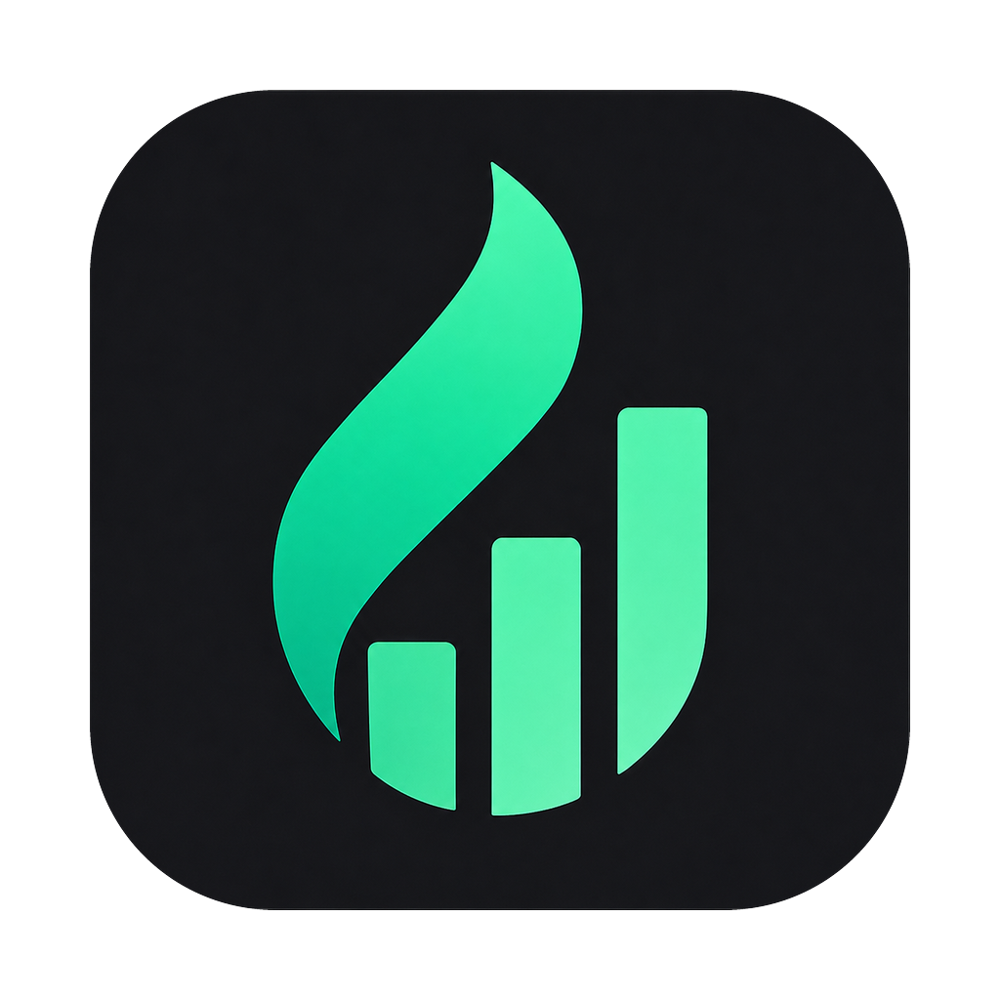

<div align="center">



# Cadence

**Yereldeki git repolarını tarayıp günün commit'lerinden Claude ile üç bölümlü geliştirici raporu üreten Mac + Windows masaüstü uygulaması.**

📝 Özet · 👔 Standup · 🔧 Teknik Günlük — hepsi tek tıkla, tamamen yerelde.

<br />

[](https://github.com/GorkemKurtkaya/cadence_app/releases)
[](https://github.com/GorkemKurtkaya/cadence_app/releases)


[**⬇️ İndir**](#️-indir) · [**✨ Özellikler**](#-özellikler) · [**🚀 Nasıl Çalışır**](#-nasıl-çalışır) · [**🛠️ Kurulum**](#️-kurulum--geliştirme) · [**🇬🇧 English**](#-english)

</div>

---

## Cadence nedir?

Cadence, gün boyu yazdığın kodu **günlük rapora** çeviren bir masaüstü aracıdır. Yereldeki
(ve istersen GitHub'daki) git repolarını tarar, seçtiğin periyodun commit + diff özetlerini
**Claude'a** yollar ve **üç bölümlü bir rapor** üretir:

| Bölüm | Kime / ne için |
|-------|-----------------|
| 📝 **Özet / Günlük** | Kendine — "bugün ne yaptım" changelog'u |
| 👔 **Standup** | Ekibe — sabah standup'ında okunacak kısa özet |
| 🔧 **Teknik Günlük** | Detay isteyene — mimari/karar notları |

Geçmiş günlerin verisi ve raporları **yerelde SQLite**'ta saklanır. **Sunucu yoktur** — tüm iş
mantığı ve sistem erişimi (git, `claude` CLI, dosya, DB) uygulamanın içindeki TypeScript servis
katmanında, Tauri plugin'leri üzerinden çalışır. Kodun ve sırların cihazından çıkmaz.

---

## ⬇️ İndir

En güncel kurulumu **[Releases](https://github.com/GorkemKurtkaya/cadence_app/releases/latest)**
sayfasından indir:

[](https://github.com/GorkemKurtkaya/cadence_app/releases/latest)

| İşletim sistemi | Dosya | Not |
|-----------------|-------|-----|
| 🍎 **macOS** (Apple Silicon + Intel) | `Cadence_x.y.z_universal.dmg` | Tek universal paket |
| 🪟 **Windows** | `Cadence_x.y.z_x64-setup.exe` | Önerilen (NSIS kurulum) |
| 🪟 **Windows** | `Cadence_x.y.z_x64_en-US.msi` | Kurumsal/MSI dağıtımı için |

> İlk açılışta macOS "doğrulanamadı" diyebilir → **Sağ tık → Aç**. Windows SmartScreen'de
> **Daha fazla bilgi → Yine de çalıştır**.

---

## ✨ Özellikler

- 🔍 **Otomatik repo tarama** — verdiğin kök klasörlerdeki tüm git repolarını bulur, günün
  commit'lerini toplar. Tüm dalları tarama ve "yalnız benim commit'lerim" seçenekleri var.
- 🤖 **Claude ile 3 bölümlü rapor** — Özet · Standup · Teknik; tek tıkla üretilir.
- 🐙 **GitHub entegrasyonu (opsiyonel)** — yerel repolara ek olarak GitHub commit'lerini de çeker
  (`gh` CLI veya token).
- 🎛️ **Esnek rapor üretimi** — periyot (Günlük / Haftalık / Aylık / Yıllık), uzunluk
  (Kısa / Orta / Detaylı), ton ve gösterilecek bölümler ayarlanabilir.
- ✅ **Commit seçimli rapor** — hangi commit'lerin rapora gireceğini SHA bazında tek tek seçebilirsin.
- ✍️ **Özel prompt şablonu** — kendi rapor formatını yaz (changelog varsayılanı hazır) + ekstra talimat.
- 📚 **Rapor geçmişi** — geçmiş günlerin raporlarına dön, tekrar oku/kopyala.
- 🔥 **Streak & katkı ısı haritası** — yıllık commit yoğunluğunu GitHub tarzı heatmap ile gör.
- 🗂️ **Projeler & alan filtresi** — izlenen repolar tek ekranda; commit'ler Backend / Frontend
  olarak filtrelenebilir.
- 🧙 **Onboarding sihirbazı** — ilk açılışta repo kökleri ve Claude modunu adım adım kurar.
- 🔌 **İki Claude modu** — yerel `claude` CLI (varsayılan) veya Anthropic API anahtarı.
- 🔒 **Yerel & güvenli** — veriler SQLite'ta cihazında; API anahtarı / token OS keychain'de,
  asla düz metin veya log'a yazılmaz.

---

## 📸 Ekran Görüntüleri

> _Görseller yakında eklenecek._

<!-- Ekran görüntülerini docs/screenshots/ altına koyup aşağıdaki yolları güncelleyin. -->

| Dashboard | Rapor | Streak |
|-----------|-------|--------|
| <!--  --> _placeholder_ | <!--  --> _placeholder_ | <!--  --> _placeholder_ |

---

## 🚀 Nasıl Çalışır

```
  Repo kökleri  ──▶  Git tarama (+ GitHub)  ──▶  Commit seç  ──▶  Claude  ──▶  3 bölümlü rapor  ──▶  SQLite geçmiş
```

1. **Repo köklerini tanımla** — repolarının bulunduğu klasör(ler)i ekle (örn. `~/Documents/GitHub`).
2. **Tara** — Cadence o kökaltındaki tüm git repolarını gezip seçtiğin periyodun commit'lerini toplar.
3. **Seç & üret** — istersen commit'leri tek tek seçip **Rapor Üret**'e bas.
4. **Oku, kopyala, geç** — üç bölümlü rapor ekranda; geçmiş sekmesinden her zaman geri dönersin.

---

## 🧩 Teknoloji


**Kabuk:** Tauri v2 (shell / sql / fs / store plugin'leri) — **Framework:** Vite + React 19 —
**Dil:** TypeScript 5 (strict) — **Stil:** Tailwind CSS v4 + shadcn/ui (new-york) + Radix —
**State:** Zustand (client) · TanStack Query (async) — **Form:** React Hook Form + Zod —
**Router:** TanStack Router — **Grafik:** Recharts — **Claude:** yerel `claude` CLI ·
`@anthropic-ai/sdk` (API) — **GitHub:** `gh` CLI · Octokit fallback.

---

## 🛠️ Kurulum & Geliştirme

```bash
# 1) Rust toolchain (yalnız bir kez — Tauri'nin derlemesi için gerekli)
curl --proto '=https' --tlsv1.2 -sSf https://sh.rustup.rs | sh

# 2) Node bağımlılıkları
npm install

# 3) Geliştirme (masaüstü penceresi açılır)
npm run tauri dev
```

- **macOS:** ayrıca Xcode Command Line Tools → `xcode-select --install`
- **Windows:** Microsoft C++ Build Tools + WebView2 (genelde kuruludur)

### Komutlar

| Komut | Açıklama |
|-------|----------|
| `npm run tauri dev` | Masaüstü uygulaması (geliştirme) |
| `npm run tauri build` | Production paket (macOS `.dmg` / Windows `.msi`/`.exe`) |
| `npm run dev` | Yalnız web katmanı (tarayıcı — Tauri API'leri çalışmaz) |
| `npm run typecheck` | `tsc --noEmit` |
| `npm run test` | Vitest (saf fonksiyon birim testleri) |
| `npm run lint` | ESLint |

### İlk kullanım

1. Uygulamayı aç → **Ayarlar** (ya da açılıştaki onboarding sihirbazı).
2. **Repo kök klasörleri**ne repolarının bulunduğu dizin(ler)i ekle.
3. **Claude modu**: varsayılan `claude` CLI (kuruluysa hazır) veya Anthropic API anahtarı (Sırlar).
4. **Dashboard**'da **Rapor Üret** → günün commit'lerinden 3 bölümlü rapor.
5. **Rapor Geçmişi** sekmesinde önceki günlere bak.

---

## 📦 Sürüm / Release Oluşturma

Release'ler **[GitHub Actions](./.github/workflows/release.yml)** ile otomatik derlenir.
`v` ile başlayan bir tag push edildiğinde `tauri-action` çalışır ve macOS universal `.dmg` +
Windows `.exe`/`.msi` üretip **taslak (draft) release** açar:

```bash
git tag v0.1.2
git push origin v0.1.2
# GitHub > Actions > Release akışı çalışır → draft release oluşur → yayımla
```

> Elle de tetiklenebilir: **GitHub → Actions → Release → Run workflow**.

---

## 📁 Proje Yapısı & Mimari

```
src/
├── features/     # Ekran bazlı: dashboard · commits · projects · history · report · streak · settings
├── components/   # ui (shadcn) · common · layout
├── services/     # TÜM iş mantığı + sistem erişimi (git, claude, sql, config, logger)
├── hooks/queries # TanStack Query hook'ları
├── stores/       # Zustand (client state)
└── lib/          # utils · query · validations · i18n
src-tauri/        # Tauri kabuğu: capabilities, plugin config, ikonlar
```

**Kritik kural:** git / `claude` / dosya / SQLite erişimi ve iş mantığı **yalnızca
`src/services/`** içinde. Detaylı mimari, kod kuralları ve klasör düzeni için → **[CLAUDE.md](./CLAUDE.md)**.

---

## 🇬🇧 English

<details open>
<summary><b>What Cadence is (short version)</b></summary>

<br />

**Cadence** is a macOS + Windows desktop app that turns your daily git activity into a **three-part
developer report** using **Claude**. It scans your local git repos (and optionally GitHub), sends the
selected period's commits + diffs to Claude, and produces:

- 📝 **Summary / Journal** — your personal changelog of the day
- 👔 **Standup** — a short version to read in the morning standup
- 🔧 **Technical log** — architecture & decision notes for the details

Everything stays local: history and reports are stored in **SQLite** on your device, secrets
(API key / token) live in the OS keychain, and there's **no server** — all logic runs in the app's
TypeScript service layer via Tauri plugins.

**Highlights:** auto repo scanning · optional GitHub integration · flexible reports
(period / length / tone / sections) · per-commit selection · custom prompt templates · report history ·
contribution streak heatmap · two Claude modes (`claude` CLI or Anthropic API).

**Download:** grab the latest build from the
**[Releases page](https://github.com/GorkemKurtkaya/cadence_app/releases/latest)** —
macOS universal `.dmg` and Windows `.exe` / `.msi`.

**Develop:**
```bash
npm install
npm run tauri dev   # requires the Rust toolchain (rustup) once, for compiling
```

</details>

---

<div align="center">

Made by **Görkem Kurtkaya** · Built with Tauri + React + Claude

</div>
